##### Phase I: Foundations and Axioms
**Intuition:** Probability theory provides a framework for quantifying uncertainty, much like how you model failure rates or latency distributions in a distributed system. Events are observed system states; axioms are the inviolable invariants governing how we measure the likelihood of those states.    
###### 1. The Probability Space  
*   **Formalism:** A probability space is a triple $(\Omega, \mathcal{F}, P)$.  
    *   **Sample Space ($\Omega$):** The set of all possible outcomes of an experiment (e.g., all possible packet arrival times).  
    *   **Event Space ($\mathcal{F}$):** A $\sigma$-algebra of subsets of $\Omega$. These are the events we can assign probabilities to.  
    *   **Probability Measure ($P$):** A function $P: \mathcal{F} \to$ satisfying the **Kolmogorov Axioms**:  
        1.  $P(E) \ge 0$ for any event $E \in \mathcal{F}$.  
        2.  $P(\Omega) = 1$.  
        3.  **Countable Additivity:** If $E_1, E_2, \dots$ are disjoint events, then $P(\bigcup_{i=1}^\infty E_i) = \sum_{i=1}^\infty P(E_i)$.  
*   **ML Application:** Defines the fundamental rules for all stochastic models. Supervised learning estimates $P(Y|X)$; generative models estimate $P(X, Y)$ or $P(X)$.
###### 2. Conditional Probability and Independence  
*   **Intuition:** Updating your belief about the system state given new logs. If Service A fails, does the probability of Service B failing increase? If not, they are independent.  
*   **Formalism:**  
    *   **Conditional Probability:** $P(A|B) = \frac{P(A \cap B)}{P(B)}$, provided $P(B) > 0$.  
    *   **Independence:** Events $A$ and $B$ are independent iff $P(A \cap B) = P(A)P(B)$. This implies $P(A|B) = P(A)$.  
    *   **Chain Rule:** $P(A_1 \cap A_2 \cap \dots \cap A_n) = P(A_1) P(A_2|A_1) P(A_3|A_2, A_1) \dots P(A_n|A_{n-1}, \dots, A_1)$.  
*   **ML Application:**  
    *   Conditional probability is the core of prediction: $P(\text{Spam} | \text{Email Content})$.  
    *   Independence assumptions (often naive) drastically simplify model complexity (e.g., Naive Bayes).  
    *   Chain rule is fundamental in sequence models (RNNs, Transformers) and Probabilistic Graphical Models (PGMs).  
###### 3. Bayes' Theorem
*   **Intuition:** The mechanism for debugging (inverse probability). Given an observed alert (Effect), what is the probability it was caused by a specific database failure (Cause)? It updates prior beliefs with new evidence.  
*   **Formalism:**  
    

$$
P(A|B) = \frac{P(B|A)P(A)}{P(B)}
$$

  
    *   $P(A|B)$: Posterior  
    *   $P(B|A)$: Likelihood  
    *   $P(A)$: Prior  
    *   $P(B)$: Evidence (Marginal Likelihood), often calculated as $\sum_i P(B|A_i)P(A_i)$.  
*   **ML Application:** The foundation of Bayesian Machine Learning. Treating model parameters $\theta$ as random variables and computing the posterior distribution $P(\theta | \text{Data}) \propto P(\text{Data} | \theta) P(\theta)$.  
##### Phase II: Random Variables and Distributions  
**Intuition:** A Random Variable (RV) is a refactoring of raw outcomes into numerical data. Instead of handling the raw event "disk read error at sector X," you map it to a metric `io_errors = 1`. A distribution is the histogram of that metric over time.  
###### 1. Random Variables (RVs)  
*   **Formalism:** An RV $X$ is a measurable function $X: \Omega \to \mathbb{R}$. It maps outcomes in the sample space to real numbers.  
*   **ML Application:** Features (inputs), labels (outputs), and sometimes model parameters are all treated as RVs.  
###### 2. Discrete vs. Continuous Distributions  
*   **Formalism:**  
    *   **Cumulative Distribution Function (CDF):** $F_X(x) = P(X \le x)$. Defined for both discrete and continuous RVs.  
    *   **Discrete RV:** Takes on a countable set of values. Characterized by a **Probability Mass Function (PMF)**: $p_X(x) = P(X=x)$.  
    *   **Continuous RV:** Takes on an uncountable set of values. $P(X=x) = 0$ for any specific $x$. Characterized by a **Probability Density Function (PDF)** $f_X(x)$, where:  
        

$$
P(a \le X \le b) = \int_a^b f_X(x) dx
$$

  
        

$$
f_X(x) = \frac{d}{dx}F_X(x)
$$

  
*   **ML Application:** Classification targets are discrete (PMF, e.g., Bernoulli/Categorical). Regression targets are continuous (PDF, e.g., Gaussian).  
###### 3. Expectation and Variance (Moments)  
*   **Intuition:** Expectation is the long-run average (e.g., average request/sec). Variance measures the jitter or instability around that average.  
*   **Formalism:**  
    *   **Expectation ($\mathbb{E}$):** The first moment (mean).  
        *   Discrete: $\mathbb{E}[X] = \sum_x x p_X(x)$  
        *   Continuous: $\mathbb{E}[X] = \int_{-\infty}^{\infty} x f_X(x) dx$  
        *   Linearity of Expectation: $\mathbb{E}[aX + bY] = a\mathbb{E}[X] + b\mathbb{E}[Y]$.  
    *   **Variance ($\text{Var}$):** The second central moment.  
        *   $\text{Var}(X) = \mathbb{E}[(X - \mathbb{E}[X])^2] = \mathbb{E}[X^2] - (\mathbb{E}[X])^2$  
    *   **Standard Deviation ($\sigma$):** $\sigma_X = \sqrt{\text{Var}(X)}$.  
*   **ML Application:** Loss functions are almost always expectations. Gradient descent relies on estimating $\mathbb{E}[\nabla \text{Loss}]$. Variance is central to bias-variance tradeoff and regularization.  
##### Phase III: Multivariate Distributions  
**Intuition:** Analyzing a microservice architecture. You cannot understand the system by looking at only one service's logs. You must model how $N$ services interact simultaneously. The joint distribution is the system snapshot; marginalization is filtering logs for a single service.    
###### 1. Joint Distributions  
*   **Formalism:** describes the simultaneous behavior of multiple RVs.  
    *   **Joint PMF:** $p_{X,Y}(x,y) = P(X=x, Y=y)$.  
    *   **Joint PDF:** $f_{X,Y}(x,y)$, where $P((X,Y) \in A) = \iint_A f_{X,Y}(x,y) dx dy$.  
*   **ML Application:** A dataset with $D$ features is a sample from a $D$-dimensional joint distribution. Most ML is about modeling $P(Y, X_1, X_2, \dots, X_D)$.  
###### 2. Marginal and Conditional Distributions  
*   **Formalism:**  
    *   **Marginalization (Sum Rule):** Recovering the distribution of a subset of variables by integrating/summing out the others.  
        *   $p_X(x) = \sum_y p_{X,Y}(x,y)$  
        *   $f_X(x) = \int_{-\infty}^{\infty} f_{X,Y}(x,y) dy$  
    *   **Conditional Distribution:**  
        *   $f_{Y|X}(y|x) = \frac{f_{X,Y}(x,y)}{f_X(x)}$  
*   **ML Application:** Supervised learning directly models the conditional distribution $P(Y|X)$. Marginalization is key in latent variable models (e.g., GMMs, VAEs) where we integrate out the latent state.  
###### 3. Covariance and Correlation  
*   **Intuition:** Normalized measurement of how two variables change together.  
*   **Formalism:**  
    *   **Covariance:** $\text{Cov}(X,Y) = \mathbb{E}[(X-\mathbb{E}[X])(Y-\mathbb{E}[Y])] = \mathbb{E}[XY] - \mathbb{E}[X]\mathbb{E}[Y]$.  
    *   **Correlation:** $\rho_{X,Y} = \frac{\text{Cov}(X,Y)}{\sigma_X \sigma_Y}$. Values are in $[-1, 1]$.  
    *   **Covariance Matrix ($\Sigma$):** For a random vector $\mathbf{X} = [X_1, \dots, X_n]^T$, $\Sigma$ is an $n \times n$ symmetric, positive semi-definite matrix where $\Sigma_{ij} = \text{Cov}(X_i, X_j)$.  
*   **ML Application:** The covariance matrix defines the shape of the Multivariate Gaussian. PCA (Principal Component Analysis) is the eigendecomposition of the covariance matrix.  
##### Phase IV: Key Distributions and Limit Theorems
**Intuition:** Standard library implementations for uncertainty. Gaussian is your default noise model. Bernoulli is your boolean. Poisson handles event rates.  
###### 1. Common Distributions  
*   **Discrete:**  
    *   **Bernoulli($p$):** Single trial, success ($1$) with probability $p$. (Binary classification).  
    *   **Binomial($n, p$):** Number of successes in $n$ independent Bernoulli trials.  
    *   **Categorical($\mathbf{p}$):** Generalization of Bernoulli to $K$ outcomes (Multiclass classification).  
    *   **Poisson($\lambda$):** Number of events in a fixed interval given a constant mean rate $\lambda$.  
*   **Continuous:**  
    *   **Uniform($a, b$):** Constant probability density over $[a, b]$. (Parameter initialization).  
    *   **Gaussian (Normal) $\mathcal{N}(\mu, \sigma^2)$:** Bell curve. Defined by mean $\mu$ and variance $\sigma^2$.  
    *   **Multivariate Gaussian $\mathcal{N}(\boldsymbol{\mu}, \Sigma)$:** The generalization to $n$ dimensions. Critical because linear combinations of Gaussians remain Gaussian, and its marginals/conditionals are also Gaussian.  
    *   **Beta($\alpha, \beta$)** and **Dirichlet($\boldsymbol{\alpha}$):** Distributions *over probabilities*. Beta is over (conjugate prior for Bernoulli). Dirichlet is over the simplex (conjugate prior for Categorical).  
###### 2. Limit Theorems
*   **Intuition:** Guarantees about aggregate system behavior.  
*   **Formalism:**  
    *   **Law of Large Numbers (LLN):** The sample average converges to the expected value as the sample size $n \to \infty$.  
        

$$
\frac{1}{n}\sum_{i=1}^n X_i \to \mathbb{E}[X]
$$

  
    *   **Central Limit Theorem (CLT):** The sum (or average) of many independent, identically distributed (i.i.d.) RVs tends toward a Gaussian distribution, *regardless of the original distribution*.  
*   **ML Application:**  
    *   LLN justifies using the training set average loss as a proxy for the true expected loss.  
    *   CLT justifies the pervasive use of Gaussian noise models and L2 loss (MSE), as errors are often the sum of many small, independent factors.  
##### Phase V: Information Theory and Estimation  
**Intuition:** Information Theory quantifies "surprise" and is analogous to data compression—how many bits do you need to encode the system state? Estimation is reverse-engineering: given the logs (data), what were the most likely system parameters that produced them?  
###### 1. Information Theory  
*   **Formalism:**  
    *   **Entropy ($H(X)$):** The average uncertainty or "surprise" in a RV.  
        

$$
H(X) = -\sum_x p(x) \log p(x) = \mathbb{E}[-\log p(X)]
$$

  
    *   **KL Divergence ($D_{KL}(P || Q)$):** Also called Relative Entropy. Measures how different distribution $Q$ is from a reference distribution $P$. It is **not** symmetric and **not** a true distance metric.  
        

$$
D_{KL}(P || Q) = \sum_x p(x) \log \frac{p(x)}{q(x)} = \mathbb{E}_{x \sim P} \left[ \log \frac{p(x)}{q(x)} \right]
$$

  
    *   **Cross-Entropy ($H(P, Q)$):** Average number of bits needed to identify an event from $P$ if we use a coding scheme optimized for $Q$.  
        

$$
H(P, Q) = H(P) + D_{KL}(P || Q) = -\sum_x p(x) \log q(x)
$$

  
*   **ML Application:**  
    *   Minimizing **Cross-Entropy Loss** is the standard objective function for classification. Since $H(P)$ (the true data distribution) is fixed, minimizing Cross-Entropy is equivalent to minimizing KL Divergence between the true labels ($P$) and the model predictions ($Q$).  
    *   KL Divergence is used in Variational Autoencoders (VAEs) and t-SNE.  
  
###### 2. Parameter Estimation  
*   **Intuition:** Fitting the model to the data.  
*   **Formalism:** given an i.i.d. dataset $\mathcal{D} = \{x_1, x_2, \dots, x_n\}$ and a model with parameters $\theta$.  
    *   **Maximum Likelihood Estimation (MLE):** Find $\theta$ that maximizes the likelihood of observing the data.  
        

$$
\theta_{MLE} = \arg\max_{\theta} P(\mathcal{D} | \theta) = \arg\max_{\theta} \prod_{i=1}^n P(x_i | \theta)
$$

  
        In practice, we maximize the Log-Likelihood (turning the product into a sum):  
        

$$
\theta_{MLE} = \arg\max_{\theta} \sum_{i=1}^n \log P(x_i | \theta)
$$

  
    *   **Maximum A Posteriori (MAP):** incorporate a prior belief $P(\theta)$ about the parameters.  
        

$$
\theta_{MAP} = \arg\max_{\theta} P(\theta | \mathcal{D}) = \arg\max_{\theta} P(\mathcal{D} | \theta)P(\theta)
$$

  
        

$$
\theta_{MAP} = \arg\max_{\theta} \left[ \sum_{i=1}^n \log P(x_i | \theta) + \log P(\theta) \right]
$$

*   **ML Application:**  
    *   MLE is the principle behind most loss functions. Minimizing Mean Squared Error (MSE) is equivalent to MLE assuming Gaussian noise. Minimizing Cross-Entropy is equivalent to MLE for Categorical/Bernoulli outputs.  
    *   MAP is equivalent to MLE with **Regularization**. For example, L2 regularization (Ridge Regression) corresponds to assuming a Gaussian prior $P(\theta) \sim \mathcal{N}(0, \tau^2)$ on the weights.
##### Connections
* Forward Links: [The Probability Space](/notes/mathematics-for-ml/the-probability-space/), [Bayes Theorem](/notes/mathematics-for-ml/bayes-theorem/), [Conditional Probability](/notes/mathematics-for-ml/conditional-probability/), [Random Variables](/notes/mathematics-for-ml/random-variables/), [Expectation and Variance](/notes/mathematics-for-ml/expectation-and-variance/), [Common Probability Distributions](/notes/mathematics-for-ml/common-probability-distributions/), [Law of Large Numbers and Central Limit Theorem](/notes/mathematics-for-ml/law-of-large-numbers-and-central-limit-theorem/), [Covariance Matrix](/notes/mathematics-for-ml/covariance-matrix/), [MLE and MAP](/notes/mathematics-for-ml/mle-and-map/)
* Backward Links:
