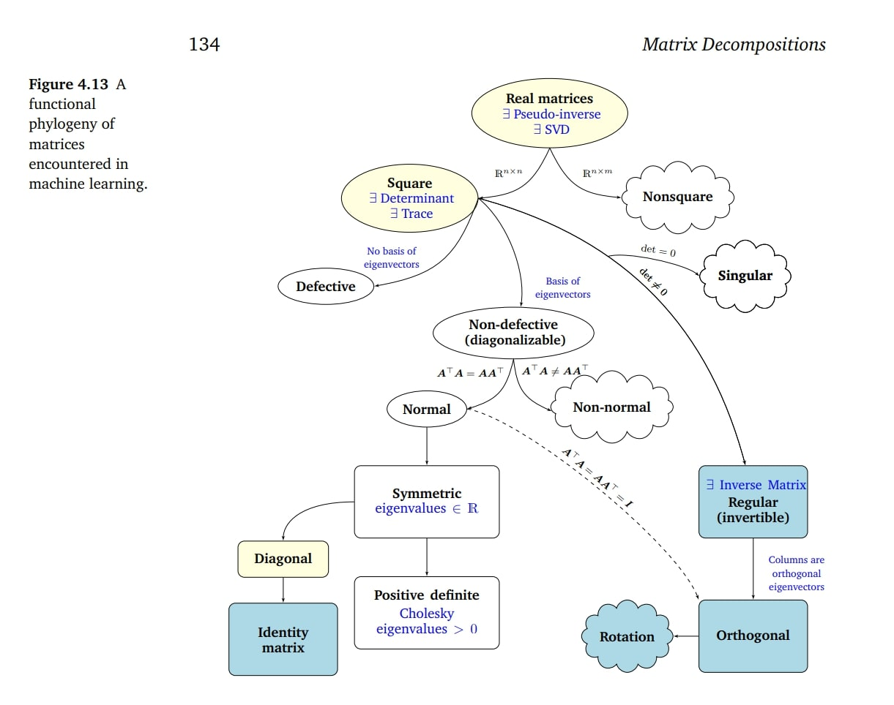

Matrix decomposition (or factorization) is the process of breaking down a complex matrix into a product of simpler, more structured matrices. This reveals hidden information, improves computational efficiency and stability, and enables data analysis.

The landscape can be broadly divided into three areas: techniques focused on solving linear systems and stability, techniques focused on revealing the intrinsic structure of the matrix (eigenvalues), and techniques focused on data analysis and approximation.
##### Mindmap
###### I. Solving Systems and Stability
These techniques aim to simplify the matrix structure—often making it triangular—to efficiently solve the equation $A\mathbf{x}=\mathbf{b}$ or to ensure numerical stability.
1. LU Decomposition (Lower-Upper)
	* The Math: $A = LU$
	* The Idea: Decomposes a square matrix $A$ into a Lower triangular matrix ($L$) and an Upper triangular matrix ($U$).
	* The Intuition: LU is formalized Gaussian elimination. $U$ is the resulting row echelon form (the simplified system), and $L$ records the sequence of operations used to get there.
	* Use Cases: Efficiently solving linear systems, calculating determinants.
2. Cholesky Decomposition
	- The Math: $A = LL^T$
	- The Idea: A specialized, faster version of LU that only works for symmetric positive-definite matrices (like covariance matrices). It decomposes $A$ into a lower triangular matrix $L$ and its transpose $L^T$.
	- The Intuition: It is analogous to taking the "square root" of the matrix $A$.
	- Use Cases: Very fast linear solvers, optimization, Monte Carlo simulations.
3. QR Decomposition (Orthogonal-Triangular)
	- The Math: $A = QR$
	- The Idea: Decomposes any matrix $A$ (including rectangular) into an Orthogonal matrix $Q$ (where $Q^TQ = I$) and an Upper triangular matrix $R$.
	- The Intuition: Orthogonal matrices represent pure rotations or reflections; they preserve angles and lengths, making them very stable. QR finds a stable, orthonormal basis ($Q$) for the space spanned by the columns of $A$. This is the matrix realization of the Gram-Schmidt process.
	- Use Cases: Solving least squares problems (finding the "best fit" when no exact solution exists), the foundation for algorithms that find eigenvalues.
###### II. Revealing Intrinsic Structure
These techniques analyze the fundamental behavior of the matrix as a linear transformation. They aim to "diagonalize" the matrix, identifying the directions where the transformation acts purely by stretching or shrinking (eigenvectors) and the magnitude of that stretch (eigenvalues).
4. Eigendecomposition (Spectral Decomposition)
	* The Math: $A = P\Lambda P^{-1}$
	* The Idea: Decomposes a square matrix $A$ into a matrix of eigenvectors $P$ and a diagonal matrix of eigenvalues $\Lambda$.
	* The Intuition: It reveals the "DNA" of the matrix. It finds a new coordinate system (defined by the eigenvectors $P$) where the complex transformation $A$ looks like simple scaling (defined by the eigenvalues $\Lambda$).
	* Limitations: Only works for square, diagonalizable matrices (those with enough independent eigenvectors).
	* Use Cases: Understanding system dynamics, stability analysis, calculating matrix powers ($A^n$) quickly.
5. Schur Decomposition
	- The Math: $A = QUQ^H$ (where $Q$ is Unitary/Orthogonal)
	- The Idea: A generalization for when Eigendecomposition fails. It decomposes $A$ into a unitary matrix $Q$ and an upper triangular matrix $U$ (which has the eigenvalues on its diagonal).
	- The Intuition: If we cannot fully diagonalize the matrix, we can at least triangularize it using a stable basis.
	- Use Cases: Theoretical linear algebra, robust eigenvalue calculations.
###### III. Data Analysis and Approximation
These techniques are vital in statistics and machine learning, used to reduce dimensionality, compress data, or extract features by finding low-rank approximations of the original data matrix.
6. Singular Value Decomposition (SVD)
	- The Math: $A = U\Sigma V^T$
	- The Idea: The "Swiss Army knife." It generalizes Eigendecomposition to all matrices (including rectangular). It decomposes $A$ into left singular vectors $U$ (orthogonal), singular values $\Sigma$ (diagonal, non-negative), and right singular vectors $V$ (orthogonal).
	- The Intuition: Any linear transformation can be broken down into a rotation ($V^T$), followed by scaling along the new axes ($\Sigma$), followed by another rotation ($U$). The singular values in $\Sigma$ are ordered by importance. By keeping only the top few, SVD provides the best low-rank approximation of $A$.
	- Use Cases: Principal Component Analysis (PCA), data compression, noise removal, recommender systems, calculating the pseudoinverse.
7. Non-negative Matrix Factorization (NMF)
	- The Math: $A \approx WH$ (where all elements of $A, W, H \geq 0$)
	- The Idea: Decomposes a non-negative data matrix $A$ into a feature matrix $W$ and a weight matrix $H$, constraining both to be non-negative.
	- The Intuition: Unlike SVD, which allows subtraction and cancellation, NMF forces a purely additive, "parts-based" representation. It explains the whole by adding up interpretable components (e.g., a face is the sum of features like eyes and noses).
	- Use Cases: Topic modeling (documents are sums of topics), image processing, audio analysis.
##### The Big Picture
The landscape moves from rigid structural simplification for computation (LU, Cholesky), to stabilizing the basis for robust solutions (QR), to understanding the fundamental dynamics of the transformation (Eigendecomposition), culminating in the universal factorization that connects structure and data approximation (SVD). NMF offers a specialized alternative for additive, interpretable data.
#### Connections
* Forward Links: [Eigenvalues and eigenvectors](/notes/eigenvalues-and-eigenvectors/), [Cholesky Decomposition](/notes/cholesky-decomposition/), [Eigendecomposition and Diagonalization](/notes/eigendecomposition-and-diagonalization/), [Singular Value Decomposition](/notes/singular-value-decomposition/)
* Backward Links: [Trace](/notes/trace/), [Determinant](/notes/determinant/)
