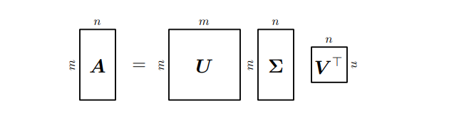

##### Formal
###### SVD
Let $A\in \mathbb{R}^{m\times n}$ be a rectangular matrix of rank $r\in[0, \min(m,n)]$. The SVD of $A$ is a decomposition of the form

$$
A=U\Sigma V^T \tag {1}
$$

with an orthogonal matrix $U \in \mathbb{R}^{m\times m}$ with column vectors $u_{i}, i=1,\dots,m$ and an orthogonal matrix $U \in \mathbb{R}^{n\times n}$ with column vectors $v_{j}, j=1,\dots,n$. Moreover, $\Sigma$ is an $m \times n$ with $\Sigma_{ii}=\sigma_{i} \geq 0$ and $\Sigma_{ij}=0, i\ne j$.
The diagonal entries $\sigma_{i}, i=1,\dots,r,$ of $\Sigma$ are called *singular values*, $u_{i}$ are called *left-singular vectors* and $v_{j}$ are called *right-singular vectors*. By convention, the singular values are ordered, i.e., $\sigma_{1} \ge \sigma_{2}\geq \sigma_{r} \ge 0$.

> [!tip] SVD exists for every matrix $A \in \mathbb{R}^{m\times n}$.
###### Construction of SVD
The construction of the Singular Value Decomposition (SVD) for any rectangular matrix $A$ is based on the properties of two related symmetric matrices: $A^TA$ and $AA^T$. The process involves finding the eigenvalues and eigenvectors of these matrices, which in turn define the components of the SVD.
**1. Find the Right-Singular Vector ($V$) and Singular Values ($\Sigma$)**
Compute the eigendecomposition of matrix $A^TA$.
* Construct $A^TA$. This is guaranteed to be an SPD matrix. ([Symmetric, Positive Definite Matrices](/notes/symmetric-positive-definite-matrices/)) which implies that its Eigenvalues are real and non-negative, and its eigenvectors form an orthonormal basis.
* **Eigendecomposition:** Find the eigenvalues $\lambda_{i}$ and the corresponding orthonormal eigenvectors.
	* The right-singular vectors ($v_{i}$) in SVD of $A$ are the eigenvectors of $A^TA$. These vectors form the columns of the orthogonal matrix $V$.
	* The singular values ($\sigma_{i}$) of the SVD of $A$ are the square root of the eigenvalues of $A^TA$. These form the diagonal matrix $\Sigma$.
These come from the substitution of SVD formula into the expression for $A^TA$:

$$
A^TA=(U\Sigma V^T)^T(U\Sigma V^T)=V\Sigma^TU^TU\Sigma V^T=V(\Sigma^T\Sigma) V^T.
$$

**2. Find the Left-Singular Vectors U**
Similar to the first step, the **left-singular vectors ($u_i$)** of A are the orthonormal eigenvectors of the matrix $AA^T$. The eigenvalues of $AA^T$ are also equal to $\sigma_i^2$.
##### Intuition
At its heart, the SVD tells us that **every linear transformation can be broken down into a sequence of three simple geometric operations: a rotation, a scaling, and another rotation**. This holds true for _any_ rectangular matrix A, making SVD a universally applicable tool.

A beautiful way to visualize this comes from observing how a matrix $A$ transforms a set of unit vectors ([Column View of a System of Linear Equations](/notes/column-view-of-a-system-of-linear-equations/#basis-transformation)) . Imagine a circle of unit vectors in your input space. Applying the matrix A will transform this circle into an ellipse in the output space. The SVD elegantly describes this transformation:
- The **right-singular vectors ($v_i$)** are the special, orthonormal vectors on the original unit circle that get mapped directly onto the principal axes of the output ellipse. They represent the principal directions of the input space.
- The **left-singular vectors ($u_i$)** are the orthonormal unit vectors that define the directions of the principal axes of the output ellipse. They represent the principal directions of the output space.
- The **singular values ($\sigma_i$)** are the lengths of these principal axes. Each $\sigma_i$ is the scaling factor applied to its corresponding vector $v_i$ to map it to an axis of length σi in the direction of $u_i$.

This fundamental relationship, $Av_i=\sigma_iu_i$, is the core geometric insight of SVD. It shows that the complex action of a matrix A can be understood as finding an orthonormal basis in the input space ($V$) that maps to an orthogonal (but scaled) basis in the output space ($\sigma_i u_{i}$).

The full decomposition $A=U\Sigma V^T$ operationalizes this as a three-step process, as shown in the diagram above 
1. **$V^T$ (First Rotation):** Aligns the principal input directions ($v_i$) with the standard coordinate axes.
2. **$\Sigma$ (Scaling):** Scales the space along these axes by the singular values σi. This is also where dimensionality might change (e.g., from $\mathbb{R}^n \rightarrow \mathbb{R}^m$).
3. **$U$ (Second Rotation):** Orients the scaled result to its final position in the output space.
##### ML Applications
SVD is a fundamental tool with broad applications in machine learning, primarily due to its ability to find optimal low-rank approximations.
- **Principal Component Analysis (PCA) and Dimensionality Reduction:** SVD provides the most direct way to perform PCA. The **Eckart-Young Theorem** states that the best rank-$k$ approximation of a matrix $A$ is found by truncating its SVD to the top $k$ singular values. This truncated SVD, $\tilde{A}(k)=U_k\Sigma_kV_k^T$, minimizes the reconstruction error. In PCA, the columns of $U_k$ (the first $k$ left-singular vectors) form the basis of the principal subspace that best captures the data's variance. 
- **Recommender Systems:** SVD can uncover latent (hidden) factors in data. In the movie-rating example (Example 4.14), SVD decomposes the user-movie matrix into vectors that represent abstract concepts like "sci-fi lover" or "art-house film," allowing for powerful recommendations based on these latent features.
- **Numerical Stability:** SVD is the preferred method for solving linear systems of equations and computing the pseudo-inverse, especially for ill-conditioned or non-square matrices.
##### Connections
* Forward Links: 
* Backward Links: [Matrix decomposition landscape](/notes/matrix-decomposition-landscape/), [Eigendecomposition and Diagonalization](/notes/eigendecomposition-and-diagonalization/), [Eigenvalues and eigenvectors](/notes/eigenvalues-and-eigenvectors/)
